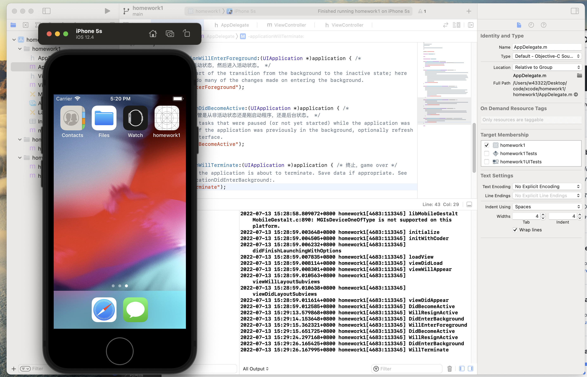
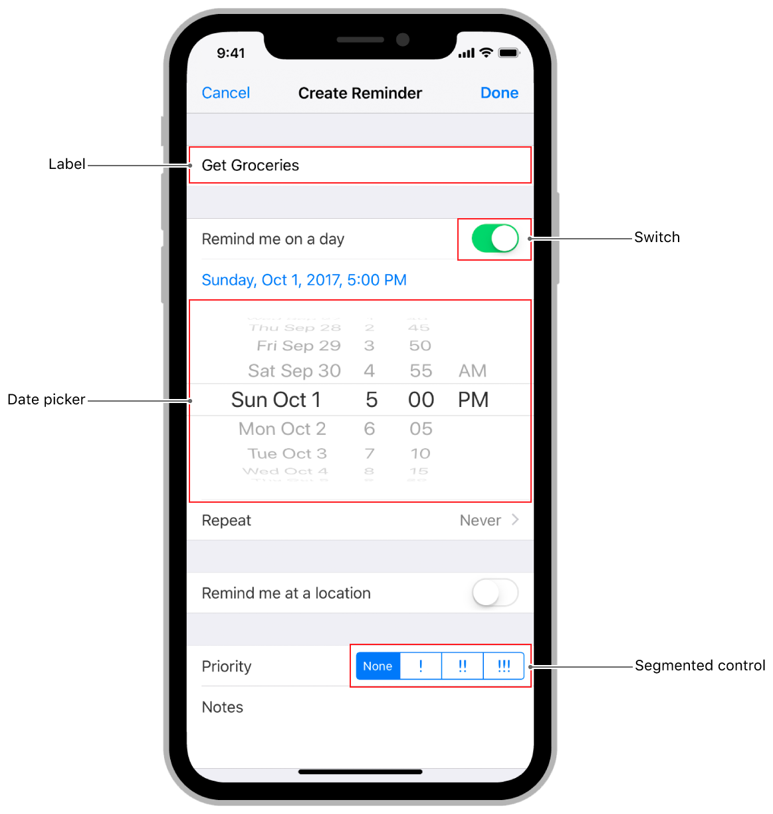

# 作业1
## 1. 按顺序打印出 App、ViewController 生命周期的各个事件



### APP生命周期
* Not running
* Inactive (Foreground)
* Active (Foreground)
* Background(Background)
* Suspended
### ViewController 生命周期
* alloc/init
* loadView
* viewDidLoad
* viewWillAppear
* viewDidAppear
* viewWillDisappear
* viewDidDisappear
* dealloc

## 2. 写出五种常用的UI控件



| 名称 | 作用 |
| --- | ---- |
| `class UIControl` | 控件的基类，是传递特定操作或意图来响应用户互动的视觉元素。 |
| `class UIButton` | 一种控件，用于执行自定代码来响应用户互动。 |
| `class UIDatePicker` | 一种用于输入日期和时间值的控件。 |
| `class UIPageControl` | 一种用于显示一系列水平点的控件，每个点对应于 App 文档或其他数据模型实体中的一个页面。 |
| `class UISegmentedControl` | 一种由多个部分组成的水平控件，每个部分用作独立的按钮。 |
| `class UISlider` | 一种用于从连续的数值范围中选择单个值的控件。 |
| `class UIStepper` | 一种用于增加或减少值的控件。 |
| `class UISwitch` | 一种提供二元选择的控件，例如开/关。 |

## 3. 列举出三个UITableViewDelegate声明的方法
```objectivec
//（1）可以分别指定cell、headerView、footerView的高度
(CGFloat)tableView:(UITableView *)tableView heightForRowAtIndexPath:(NSIndexPath *)indexPath
(CGFloat)tableView:(UITableView *)tableView heightForHeaderInSection:(NSInteger)section
(CGFloat)tableView:(UITableView *)tableView heightForFooterInSection:(NSInteger)section

//（2）可以分别在cell、headerView、footerView显示前、显示后的对它们进行一些设置。
(void)tableView:(UITableView *)tableView willDisplayCell:(UITableViewCell *)cell forRowAtIndexPath:(NSIndexPath *)indexPath
(void)tableView:(UITableView *)tableView willDisplayHeaderView:(UIView *)view forSection:(NSInteger)section
(void)tableView:(UITableView *)tableView willDisplayFooterView:(UIView *)view forSection:(NSInteger)section
(void)tableView:(UITableView *)tableView didEndDisplayingCell:(UITableViewCell *)cell forRowAtIndexPath:(NSIndexPath*)indexPath
(void)tableView:(UITableView *)tableView didEndDisplayingHeaderView:(UIView *)view forSection:(NSInteger)section
(void)tableView:(UITableView *)tableView didEndDisplayingFooterView:(UIView *)view forSection:(NSInteger)section

//（3）指定每个分区的headerView、FooterView
(nullable UIView *)tableView:(UITableView *)tableView viewForHeaderInSection:(NSInteger)section; 
(nullable UIView *)tableView:(UITableView *)tableView viewForFooterInSection:(NSInteger)section

//（4）指定每一行对应的CellView，在这里绑定数据
(UITableViewCell *)tableView:(UITableView *)tableView cellForRowAtIndexPath:(NSIndexPath *)indexPath

//（5）指定每个分区默认headerView的title、默认FooterView的title
(nullable NSString *)tableView:(UITableView *)tableView titleForHeaderInSection:(NSInteger)section 
(nullable NSString *)tableView:(UITableView *)tableView titleForFooterInSection:(NSInteger)section

//（6）指定要显示在table右侧的快速浏览列表的分区名单（section title list）
(nullable NSArray<NSString *> *)sectionIndexTitlesForTableView:(UITableView *)tableView

//（7）指定点击快速浏览列表的某个title时，tableView滑动到哪个section
(NSInteger)tableView:(UITableView *)tableView sectionForSectionIndexTitle:(NSString *)title atIndex:(NSInteger)index
```